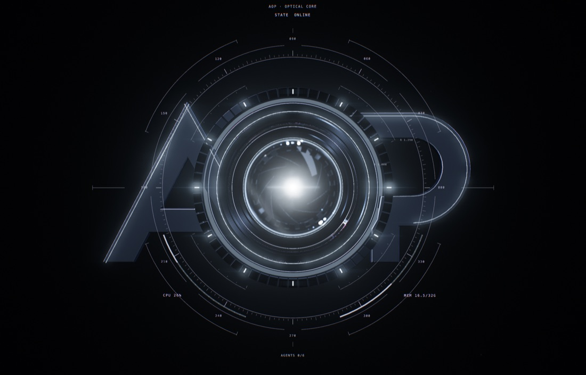
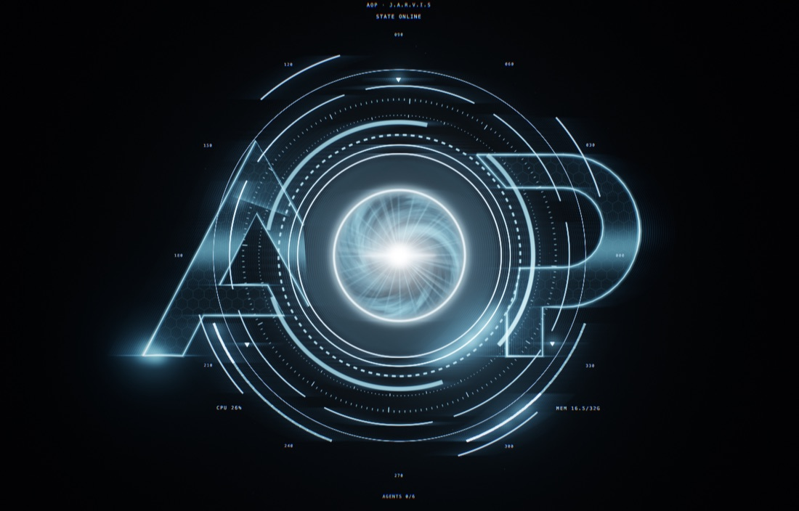

# AOP Orb

The Orb is a real-time Three.js scene in `apps/desktop/src/orb/`. It's a **holographic light construct** in the JARVIS idiom:
- an arc-reactor core inside the O;
- a live voice waveform;
- eight counter-rotating ring layers;
- a radar sweep;
- shockwaves on speech;
- the A and P drawn as light.

Everything is emissive. Each frame reads live state directly, without going through React: runtime state and tasks from the store, the mic analyser, the speech-output analyser, and system telemetry.

| Before (physical metal and glass) | After (holographic) |
|---|---|
|  |  |

Per-state frames: `captures/holo/{online,speaking,thinking,executing}.jpg`. Boot: `captures/holo/boot-{1.2,2.0,2.6}.jpg`.

## Scene graph (`scene.ts`)

Units: orb units, where 1.0 is the O's outer radius. Layers sit at different depths (z) so the camera drift gives real parallax.

| Group | Contents | z |
|---|---|---|
| Core | Arc-reactor core quad (`holoShaders.core`): pin, white-hot centre, swirling domain-warped plasma inside the O, god rays, lit inner rim. Faint O band and bright O rim. Shockwave pool (6). Voice waveform ribbon + glow ribbon. | −0.05 … 0.05 |
| Frames | A and P from `mark.ts` polylines: hologram fill (scanlines, hex lattice, travelling scan band), a 0.013 edge ribbon and a 0.06 glow ribbon. Edges draw on during boot; pulses travel along them, faster while agents run. | −0.1 |
| Rings | Eight ring meshes (table below) on annulus geometry with `aU`/`aV`, all patterns procedural in `holoShaders.ring`. Three orbiting triangle markers. Radar sweep. | 0.04 … 0.24 |
| HUD | Degree labels, title, state, CPU/MEM labels and gauges bound to real telemetry, agent count. | 0.3 |
| Particles | Orbiting sparks (burst outward on speech, pulled in by the mic) and far dust. | −3 … 0.3 |
| Agents | Hex node + glow per running agent at its fixed slot, link with travelling packets. | 0.02 |

### Ring families (`RING_SPECS`)

| Ring | r | Pattern | Speed (rad/s × state spin) |
|---|---|---|---|
| EnergyRing | 1.085 | Solid with a travelling highlight; flashes with speech, cyan with the mic | 0 (the highlight flows) |
| DashRing | 1.18 | 96 dashes | +0.32 |
| ArcRing | 1.30 | 3 segmented arcs with highlight | −0.13 |
| FringeRing | 1.36 | 240 fine ticks, major every 10 | −0.13 |
| TickRing | 1.50 | 180 ticks, major every 15; brightens with the mic | +0.045 |
| SegmentRing | 1.64 | 8 segments with a fast highlight; triangle markers orbit just outside | −0.075 |
| HairRing | 1.79 | Hairline | 0 |
| BracketRing | 2.00 | 4 brackets; carries the approval/error alert colour | +0.035 |

## Shaders (`holoShaders.ts`)

| Shader | Role |
|---|---|
| `ring` | Modes: solid, dashes, ticks, segments. Anti-aliased with `fwidth`. Travelling highlight, angular draw-on with a hot leading edge, alert flicker. |
| `ribbon` | Polyline light: soft cross-section, shimmer, two travelling pulses, draw-on head. Used for A/P edges and the waveform. |
| `holoFill` | A/P hologram fill: scanlines, hex lattice, moving scan band. |
| `core` | Arc-reactor core. `uFlash` is the JARVIS voice envelope. |
| `shock` | Expanding ring front. |
| `sweep` | Radar wedge with a sharp leading edge and banded trail. |
| `sparks` | Point sprites with twinkle, speech burst and mic pull. |

`shaders.ts` keeps the shared pieces: glow sprite, gauge, agent link, background and the composite pass.

## Speech → core (the "JARVIS is talking" signal)

The renderer turns the speech-output analyser into envelopes:

| Envelope | Attack | Release | Source |
|---|---|---|---|
| level | 30 ms | 180 ms | RMS |
| low, mid, high | 30 ms | 180 ms | Bands |

The scene derives a **flash** envelope from that: 18 ms attack, 110 ms release. Every syllable produces a sharp pulse.

| Flash drives | |
|---|---|
| Core | White-hot centre and god rays |
| O rim and inner rim | |
| EnergyRing | Brightness, plus highlight gain on every ring |
| Spark burst | |
| Onset | A rise of more than 0.1 above 0.18 emits a shockwave, rate-limited to one per 220 ms |
| Waveform | The ribbon at r 1.085 is displaced by the real 8 output bands, mirror-symmetric with fine jitter |

The waveform turns cyan and follows the mic bands when the user is the one talking.

The flash is carried by thin, hot elements (rims, rays, shock fronts) rather than one large HDR blob. A large blob would flood the bloom and grey the frame.

## Post-processing (`renderer.ts`)

```
Bloom pass (½ res):  bloom-tagged emitters only  →  UnrealBloomPass (strength preset, radius 0.22, threshold 1.25)
Main pass (MSAA):    full scene into a HalfFloat target (linear HDR)
Composite:           + bloom ×0.9 + anamorphic streak (0.03, flare/ignite boost)
                     → exposure 1.05 → ACES → vignette 0.5 → chromatic aberration 0.002 → sRGB → grain 0.005
```

**Sharpness rules:**
- Ring bands and ribbons have 1-pixel anti-aliased edges (`fwidth`) with a flat interior, not soft gaussians.
- Chromatic aberration, streak and grain are minimal.
- The bloom threshold sits above the linework, so lines never halo; only the core, highlights, speech flashes and shock fronts bloom.
- HUD text renders from 96 px glyph textures with mipmaps and anisotropic filtering.
- Shock fronts stay thin (0.005–0.009) as they expand.

## Camera rig

`PerspectiveCamera` (30° FOV) fitted so the z = 0 plane matches the 2.9 × 2.55 extent (DOM agent labels use the same math).

| Behaviour | Value |
|---|---|
| Idle drift | Sub-degree yaw/pitch drift, plus distance breathing |
| LISTENING | Push in |
| THINKING | FOV tightening |
| EXECUTING | Depth expansion |

## State art direction (`params.ts`)

All values ease toward their targets (τ = 0.28 s; LISTENING 0.12 s, SPEAKING 0.15 s).

| State | Character |
|---|---|
| DORMANT | Near-black, faint frames, slow spin |
| ONLINE | Ice-cyan hologram, all rings turning, gentle sweep |
| LISTENING | Cyan; tick and energy rings and the waveform follow the mic; sparks pulled in; spin ×1.5 |
| THINKING | Spin ×2.8, strong radar sweep, faster plasma swirl, FOV tightens |
| EXECUTING | Spin ×2, agent nodes and links, frame pulses speed up, depth expands |
| SPEAKING | Per-syllable core flash, voice waveform, shockwaves on onsets, spark bursts |
| WAITING_APPROVAL | Amber on the bracket ring, slow spin |
| ERROR | Red on the bracket ring, slight flicker, slow spin |
| SLEEP / ambient | Dim, slow |

### Cold-boot timeline (`BOOT`, seconds)

| t | Visual |
|---|---|
| 0.2 | Seed point of light |
| 0.7–1.7 | A/P edges draw on with light heads, frames slide forward from depth |
| 1.0–3.0 | Core ignites |
| 1.8–2.5 | Rings draw on angularly, outward by radius |
| 2.0–3.0 | HUD |
| 2.5 | Flare, streak and a boot shockwave |
| 3.4 | Interactive (readiness-gated) |

## Quality presets

| Preset | Pixel ratio cap | Bloom strength | Sparks | Max fps |
|---|---|---|---|---|
| LOW | 1 | off | 120 + 90 dust | 30 |
| BALANCED | 1.5 | 0.65 | 270 + 150 | 60 |
| HIGH (default) | 2 | 0.70 | 430 + 210 | 60 |
| ULTRA | 3 | 0.75 | 650 + 330 | 120 |

- **Frame budget by state:** DORMANT/SLEEP ≤ 20 fps, idle ONLINE ≤ 30 fps, otherwise the preset maximum. A hidden window stops rendering.
- **Adaptive pixel ratio:** if the frame interval stays above 1.35× budget for 2.5 s, the internal pixel ratio drops by 0.25.
- **Measured:** the scene is about 37 k triangles and about 120 draw calls, versus about 300 k triangles before. On an M5 the CPU cost is under 0.5 ms per frame at a steady 60 fps.

## Debugging

**Developer › Graphics** shows live stats and toggles for:
- depth layers (exploded view);
- bloom;
- particles;
- freeze animation.

**Orb Lab** (`apps/desktop/orb-lab.html`, dev only) renders the Orb without Tauri:

```bash
pnpm --filter desktop dev        # then open http://localhost:1420/orb-lab.html?state=SPEAKING
```

| URL param | |
|---|---|
| `state` | |
| `quality` | |
| `agents` | e.g. `code,research` |
| `audio` | `speech`, `mic` or `none` |
| `debug` | e.g. `!bloom,!particles,layers` |
| `bootT` | |
| `snap=0` | |
| `telemetry=0` | |

Lab audio is a labelled synthetic speech envelope so SPEAKING and LISTENING can be captured. The app only ever uses the real analysers.

## Limitations

- The A/P fill is a flat hologram treatment. There's no volumetric depth inside the letters.
- No true volumetric light; the depth impression comes from layered additive shaders, parallax and bloom.
- Captures were taken in Chromium (Metal via ANGLE) through Orb Lab. The app runs the same WebGL 2 code in WKWebView.
- GPU time isn't measured directly (no timer queries in WKWebView); the frame interval is the proxy.
