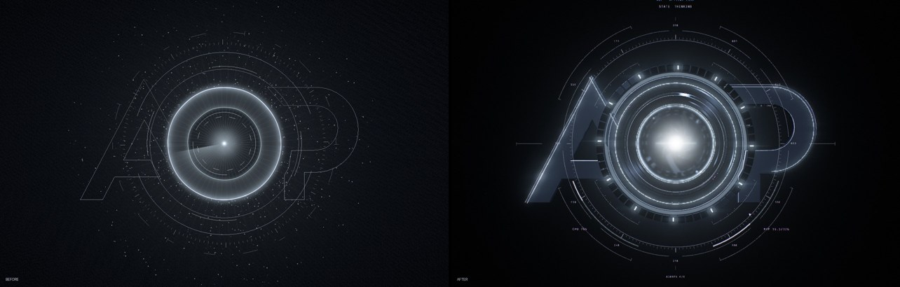

# AOP Orb

The Orb is a real-time Three.js scene in `apps/desktop/src/orb/`. It is built as a physical optical instrument in 3D space: a machined O housing with a deep lens barrel, stacked glass, an iris, a segmented mechanical ring, A and P plates, and a precision HUD in front. Each frame it reads live state directly, without going through React: the runtime state and tasks from the store, the mic analyser, the speech-output analyser, and system telemetry.



## Why the old Orb looked primitive (audit)

| Problem | Cause in the old `renderer.ts` |
|---|---|
| No depth, no parallax | `OrthographicCamera`; every object at `z = 0` |
| Thin line art | Rings, A/P and ticks were `LineSegments` (1 px GL lines), additive |
| No material definition | No lights, no environment map, no PBR materials |
| Glass and lens were "drawn" | The core was one full-screen 2D shader |
| Everything glowed | `UnrealBloomPass` over the whole frame (threshold 0.42) |
| Star-field noise | 220–1600 particles at one depth |
| A/P read as faint outlines | Polylines at 16–30 % alpha |

## Scene graph (`scene.ts`)

Units: 1 = the O's outer radius; +z points at the camera.

```
AOPOrbScene
├── CoreAssembly                     z −0.95 … +0.12
│   ├── EnergyNucleus   (billboard shader, z −0.62) + PointLight that lights the barrel interior
│   ├── Aperture        9 extruded iris blades on pivots (z −0.42); opening = visual.aperture
│   ├── RetainingRing01–04  lathe rings stepping inward with depth → lens barrel seen from the front
│   ├── InnerMechanism  24 toothed sectors (InstancedMesh), contra-rotates while thinking
│   ├── CoreGlass       front lens element (physical glass, transmission)
│   ├── InnerLens       second element deeper in the barrel
│   ├── InternalRefraction  emissive inner lens rim (mid-band speech response)
│   ├── FineRadialTicks     72 emissive ticks (high-band speech response)
│   ├── BackPlate + two annular reflection ghosts at different depths
├── OpticalAssembly
│   ├── OHousing        LatheGeometry profile: chamfered lip, recessed channel, inner lip, 0.96-deep bore
│   ├── LensRing01      glass torus seated in the channel
│   ├── ReflectiveRing  polished chrome
│   ├── GlassCylinder   open cylinder with a fresnel shader (barrel edge visible on parallax)
│   └── FresnelRing     energy transport ring (Ring 04)
├── MechanicalAssembly
│   ├── AFrame / PFrame extruded, bevelled plates behind the O (faces: graphite plate, sides: polished edge)
│   ├── LightPath       emissive inlay strips: A's legs → O → P's top edge and bowl; pulses while agents run
│   └── SegmentRing02   60 extruded sectors + 12 emissive inserts
├── HUDAssembly (z +0.24)
│   ├── RadialTicks     180 instanced ticks; mic bands lengthen them (user → outer ring)
│   ├── DialRings / CalibrationMarks / alignment datums (merged geometry, 1 draw call each)
│   ├── TargetingRing05 four arcs with brackets; local alert sector (approval amber / error red)
│   ├── DataSegments    CPU and memory arc gauges bound to real telemetry
│   ├── ScanMarker      only visible while thinking/executing
│   └── Labels          canvas-texture planes: degree indices, STATE, CPU, MEM, AGENTS, R 1.000 / R 1.290
├── EnergyAssembly      CoreGlow (front glare), Halo, LightSweep across the front glass
├── ParticleAssembly    far (z −4…−1.6) · mid (optical band, flow-reactive) · near (rare, defocused)
└── AgentOrbitAssembly  chrome beads + emissive node glow + link ribbons with travelling packets
```

### Ring families

| Ring | Radius | Material | Motion |
|---|---|---|---|
| 01 glass optical | 0.832 | physical glass | fixed |
| 02 mechanical segmented | 1.235–1.345 | dark metal + emissive inserts | only THINKING (−) / EXECUTING (+) |
| 03 HUD radial | 1.72 | additive hairline quads | fixed; ticks react to the mic |
| 04 energy transport | 1.018 | emissive shader | pulses travel inward (user) or outward (JARVIS) |
| 05 external targeting | 2.06 | hairline + alert sector | only EXECUTING |
| inner mechanism | 0.50–0.575 | dark metal | THINKING contra-rotation |

Stillness is the default: in ONLINE nothing rotates except a 0.015 rad/s inner drift.

## Materials (`materials.ts`)

| Material | Model | Key properties |
|---|---|---|
| Housing (O) | `MeshPhysicalMaterial` | metalness 1, roughness 0.30, **circular anisotropy 0.6** (lathe UVs make the tangent circumferential), procedural lathe-groove normal map + banded roughness map, clearcoat 0.35 |
| Plate (A/P faces) | physical | graphite 0x4a525e, metalness 0.5, roughness 0.42, micro-texture roughness |
| Edge (A/P sides, iris) | physical | metalness 1, roughness 0.18 — catches the strip lights → bright edges |
| Ring | physical | metalness 1, roughness 0.27, anisotropy 0.5 |
| Interior | physical | near-black, roughness 0.45 — lit mostly by the nucleus point light |
| Chrome | physical | roughness 0.07 |
| Glass | physical | transmission 1, IOR 1.52, thickness 0.06, roughness 0.012, attenuation (ice), thin-film iridescence 0.28 (AR-coating sheen) |
| Glass lite | physical | no transmission, opacity 0.12 — LOW quality, glass toggle, or adaptive fallback |

The environment is a procedural studio rendered once into a PMREM: a ring light behind the camera (circular highlights on round faces), two thin vertical strips (chamfer edges), a soft top key, faint floor bounce, cool rim from behind. Direct lights: nucleus point light (inside the barrel), a bounce light in front of the iris, a key light for the plates, a rim light.

## Shaders (`shaders.ts`)

| Shader | What it does |
|---|---|
| `nucleus` | White-hot pinpoint → blue-white plasma → domain-warped fbm corona → shell → halo, all HDR. Low band breathes, onset ignites. Slow, low-amplitude turbulence: engineered, not fire. |
| `energyRing` | Angle-based travelling bands; phase is integrated on the CPU so direction changes never jump. |
| `strip` | A→O→P light path with draw-on reveal (boot) and a travelling pulse. |
| `gauge` | Arc gauge with a lit fraction bound to a real value. |
| `particles` | Three depth layers, radial flow driven by an integrated phase, depth-attenuated size, soft discs for the near layer. |
| `link` | Agent link with per-slot intensity and packets while the agent runs. |
| `fresnelShell` | Edge-only glass cylinder. |
| `composite` | Final pass (below). |

## Post-processing (`renderer.ts`)

```
Bloom pass (half res):  scene with every non-emissive mesh swapped to a black occluder,
                        HUD / glass / particles hidden  →  UnrealBloomPass (threshold 0)
Main pass (MSAA ×4):    full scene into a HalfFloat target (linear HDR, no tone mapping)
Composite:              + bloom + anamorphic streak (bloom buffer only, 16 taps)
                        → exposure 0.92 → ACES filmic → vignette → radial chromatic aberration (0.008)
                        → sRGB → film grain (±0.006)
```

Bloom is selective by construction: only objects tagged `bloom` (nucleus, energy ring, inner lens rim, fine ticks, segment inserts, light path, agent nodes and links, alert sector) can emit into it, and the opaque structure occludes them. No depth of field and no lens dirt (both judged not worth their cost or restraint).

## Camera rig

`PerspectiveCamera` (30° FOV) fitted so the z = 0 plane matches the old 2.9 × 2.55 extent (DOM agent labels use the same math).

| Behaviour | Value |
|---|---|
| Idle orbital drift | yaw ±0.7°, pitch ±0.45° (23 s / 31 s periods) |
| Breathing | distance ±0.25 % (9 s) |
| Wake / LISTENING | push in 3.5 % |
| THINKING | FOV −1.8 % (focus tightening) |
| EXECUTING | +2.5 % distance, assemblies' z-spread ×1.12 (depth expansion) |

## State art direction (`params.ts`)

All values ease toward targets (τ = 0.28 s; LISTENING 0.12 s so wake feels instant).

| State | Character |
|---|---|
| DORMANT | Almost black, faint metal silhouette (env 0.16), tiny nucleus, iris nearly closed, few particles |
| BOOTING | See the cold-boot timeline |
| ONLINE | Baseline; nothing moves except a slow inner drift |
| LISTENING | Outer HUD ticks + energy ring react to the mic (cyan, inward flow); nucleus stable; camera push |
| THINKING | Inner mechanism contra-rotates, mech ring counter-rotates, iris tightens, scan marker, FOV tightens, flow inward |
| EXECUTING | Agent nodes and links separate from the O, packets travel to running agents, light-path pulse, targeting ring turns, depth expands |
| SPEAKING | Nucleus breathes with the low band, inner lens rim with mids, fine ticks with highs, energy flows outward |
| WAITING_APPROVAL | Amber alert sector only; mechanisms still |
| ERROR | Red alert sector only, iris closes, nucleus dims — no full-screen red |

Daily wake (DORMANT/ONLINE → LISTENING) fires a 220 ms ignition impulse (nucleus flash, energy ring, light sweep, slight push). It never replays the boot sequence.

### Cold-boot timeline (`BOOT`, seconds)

| t | Visual |
|---|---|
| 0.2 | Seed point of light |
| 0.7–1.7 | A and P slide forward from depth, reflections come up, inlay strips draw on |
| 1.0–3.0 | O housing reflections, nucleus grows |
| 1.2–1.8 | Iris opens, inner mechanisms light |
| 1.8–2.5 | Rings activate outward by radius (inserts light sequentially) |
| 2.0–3.0 | HUD |
| 2.5 | Flare (streak + sweep) |
| 3.4 | Interactive (readiness-gated as before) |

Frames: `docs/captures/after/boot-*.jpg`. Developer › Graphics › *Replay cinematic boot* replays it on demand.

## Audio reactivity

| Source | Feature | Drives |
|---|---|---|
| Speech output analyser (post-mastering, i.e. what is heard) | RMS, low (80–450 Hz) | Nucleus breathing, point-light intensity |
| | mid (450 Hz–2.7 kHz) | Inner lens rim |
| | high (2.7–8 kHz) | Fine radial ticks |
| | onset after ≥220 ms quiet | Ignition impulse |
| | release | 180 ms smooth decay |
| Mic analyser | RMS + 8 bands (LISTENING only) | Outer HUD ticks, energy-ring inward pulses, mid particles flow inward |

No synthetic amplitude exists in the app; when nothing plays, values decay to zero. (The Orb Lab capture harness uses a labelled synthetic envelope so screenshots of LISTENING/SPEAKING are possible.)

## Quality presets and adaptive degradation

| Preset | Pixel ratio cap | MSAA | Bloom | Transmission | Particles (far/mid/near) | Max fps |
|---|---|---|---|---|---|---|
| LOW | 1 | — | off | off (lite glass) | 30/40/0 | 30 |
| BALANCED | 1.5 | 2 | 0.65, ½ res | ½ res | 50/70/3 | 60 |
| HIGH (default) | 2 | 4 | 0.72, ½ res | ¾ res | 70/110/5 | 60 |
| ULTRA | 3 | 4 | 0.75, ¾ res | full | 110/170/7 | 120 |

Frame budget by state: DORMANT/SLEEP ≤ 20 fps, idle ONLINE ≤ 30 fps, otherwise the preset's max; hidden window stops rendering.

Interface modes pick the quality: CINEMATIC and DEVELOPER use the configured preset, STANDARD caps at BALANCED, AMBIENT uses LOW at ≤ 24 fps.

**Adaptive:** if the frame interval stays above 1.35× budget for 2.5 s, the internal pixel ratio drops by 0.25 (down to the preset floor); at the floor, transmission is replaced by lite glass. It steps back up after 8 s of headroom.

## Debugging

Developer › Graphics shows live fps, frame interval, CPU ms per frame, draw calls (all passes), triangles, programs, geometries, textures, particle count, pixel ratio and degradation state, plus toggles: depth layers (exploded view), ring IDs, particle bounds, bloom, particles, physical glass, freeze animation.

**Orb Lab** (`apps/desktop/orb-lab.html`, dev only) renders the Orb without Tauri:

```bash
pnpm --filter desktop dev                     # then open http://localhost:1420/orb-lab.html?state=THINKING
node scripts/capture-orb.mjs docs/captures/after          # all states (PNG)
STATES=THINKING node scripts/capture-orb.mjs out http://localhost:1420 "&debug=layers,ringIds"
STATES=BOOTING node scripts/capture-orb.mjs out http://localhost:1420 "&bootT=1.6&snap=0"
DSF=2 CLIP=440,210,400,400 STATES=SPEAKING node scripts/capture-orb.mjs out   # core close-up
```

URL params: `state`, `quality`, `agents=code,research`, `audio=speech|mic|none`, `debug=…,!bloom`, `bootT`, `snap=0`, `telemetry=0`.

## Known differences from Concept 04 / limitations

- **Concept 04 itself is not in the repository**, so the comparison above is against its written description, not pixels. Put the image at `docs/reference/orb-target.png`.
- Captures were rendered by SwiftShader (software GL) in a Linux container. Transmission is sampled at ¾ resolution there, so thin glass highlights look slightly jagged; HUD text uses a fallback monospace font (SF Mono is macOS-only). The look on the Mac must be confirmed.
- The nucleus reads as a strong glow with a hot centre; in SPEAKING it can wash the inner glass more than a concept frame would. Tune `nucleus` / `CoreGlow` against the real reference.
- A/P plates are clearly structural now, but their faces are flat extrusions. A concept-art level of panel detail (seams, bolts, recesses) is not modelled.
- No caustics or true volumetric scattering; the volume impression comes from layered additive shaders.
- WebGL 2 only; WebGPU was not adopted (no quality gain worth the migration risk for this scene).
- GPU time is not measured directly (WKWebView exposes no timer query). Frame interval is the proxy.
